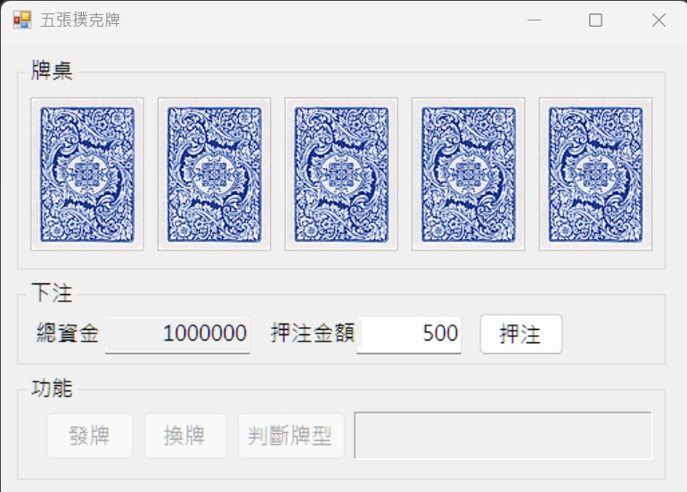
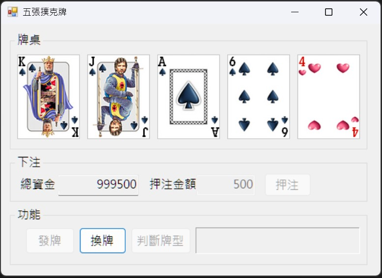

# 五張撲克牌遊戲

## 專案簡介

本專案為「視窗程式設計 (II)」上課練習：五張撲克牌遊戲。  
程式提供基本撲克牌發牌、換牌、判斷牌型功能，並加入下注系統，玩家可以輸入押注金額，系統會根據最後牌型與賠率計算中獎金額。

## 功能介紹

- 發牌功能
- 換牌功能
- 五張牌牌型判斷
- 下注金額輸入
- 總資金顯示
- 根據牌型賠率計算獎金

## 牌型賠率

| 牌型 | 賠率 |
|---|---:|
| 皇家同花順 | 250 |
| 同花順 | 50 |
| 四條 | 25 |
| 葫蘆 | 9 |
| 同花 | 6 |
| 順子 | 4 |
| 三條 | 3 |
| 兩對 | 2 |
| 一對 | 1 |

## 執行環境

- Visual Studio
- Windows 作業系統
- Windows Forms / 視窗程式專案

## 執行方式

1. 下載或 clone 本專案。
2. 使用 Visual Studio 開啟專案中的 `.sln` 檔案。
3. 確認專案建置設定正確。
4. 點選「開始偵錯」或按下 `F5` 執行程式。
5. 進入遊戲畫面後，可輸入押注金額並進行發牌、換牌與牌型判斷。

## 操作說明

1. 輸入本回合押注金額。
2. 點選「下注」按鈕。
3. 點選「發牌」取得五張撲克牌。
4. 可依需求選擇要保留或更換的牌。
5. 點選「換牌」後取得最終牌組。
6. 點選「判斷牌型」顯示目前牌型。
7. 系統會依照牌型賠率計算中獎金額，並更新總資金。

## 專案截圖

請將程式執行畫面截圖放在下方。

### 遊戲主畫面



### 下注功能畫面



## 專案結構

```text
專案資料夾/
├── README.md
├── .gitignore
├── 學號_姓名.txt
├── screenshots/
│   ├── main.png
│   └── bet.png
└── 原始程式碼檔案